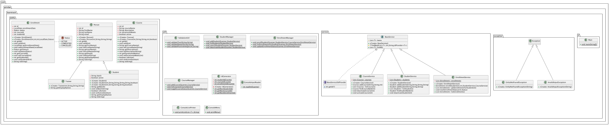

# LearnTrack - Student Course Management System

## 📚 Project Description

**LearnTrack** is a console-based course management system built in Java that enables educational institutions to manage students, courses, and enrollments efficiently.

### Key Features
- ✅ **Student Management** - Add, search, list, and deactivate students
- ✅ **Course Management** - Create courses and toggle their active status
- ✅ **Enrollment Tracking** - Enroll students in courses and track enrollment status
- ✅ **Status Management** - Mark enrollments as ACTIVE, COMPLETED, or CANCELLED
- ✅ **Clean Architecture** - Well-organized code with separation of concerns

### Technology Stack
- **Language:** Java 25.0.3 LTS
- **Architecture:** Service-based with utility layers
- **Design Patterns:** Inheritance, Static Members, Generic Collections

---

## 🚀 Quick Start

### Prerequisites
- Java Development Kit (JDK) 25.0.3 LTS installed
- Basic understanding of Java and command line

For detailed JDK setup instructions, see [Setup_Instructions.md](docs/Setup_Instructions.md)

---

## 📦 How to Compile and Run

### Step 1: Compile the Project

Open terminal/command prompt in the project root directory and run:

```bash
javac -d bin src/com/airtribe/learntrack/**/*.java
```

**What this does:**
- `-d bin` - Output compiled `.class` files to `bin/` directory
- `src/com/airtribe/learntrack/**/*.java` - Compiles all Java files in the source tree

**Expected result:** No errors displayed, and `bin/` directory is populated with `.class` files

### Step 2: Run the Application

```bash
java -cp bin com.airtribe.learntrack.ui.Main
```

**What this does:**
- `-cp bin` - Sets classpath to the `bin/` directory containing compiled classes
- `com.airtribe.learntrack.ui.Main` - Fully qualified class name to execute

### Step 3: Use the Application

The interactive menu will appear:

```
=== LearnTrack Console Menu ===
1. Add student
2. View all students
3. Search student by ID
4. Deactivate student
5. Add course
6. View all courses
7. Activate/Deactivate course
8. Enroll student in course
9. View enrollments for a student
10. Mark enrollment as completed/cancelled
11. Exit

Choose an option:
```

Follow the prompts to interact with the system.

---

## 📁 Project Structure

```
LearnTrack/
├── src/                                    # Source code directory
│   └── com/airtribe/learntrack/
│       ├── ui/
│       │   └── Main.java                   # Application entry point
│       ├── service/
│       │   ├── BaseService.java            # Abstract base class for services
│       │   ├── StudentService.java         # Student business logic
│       │   ├── CourseService.java          # Course business logic
│       │   └── EnrollmentService.java      # Enrollment business logic
│       ├── entity/
│       │   ├── Person.java                 # Base entity for people
│       │   ├── Student.java                # Student entity
│       │   ├── Course.java                 # Course entity
│       │   ├── Enrollment.java             # Enrollment entity
│       │   ├── Trainer.java                # Trainer entity
│       │   └── Status.java                 # Enrollment status enum
│       ├── util/
│       │   ├── IdGenerator.java            # Unique ID generation
│       │   ├── ValidationUtil.java         # Input validation utilities
│       │   ├── ConsoleInputReader.java     # Safe integer input handling
│       │   ├── ConsoleListPrinter.java     # Generic list display
│       │   ├── ConsoleMenu.java            # Menu display
│       │   ├── StudentManager.java         # Student UI operations
│       │   ├── CourseManager.java          # Course UI operations
│       │   └── EnrollmentManager.java      # Enrollment UI operations
│       └── exception/
│           ├── EntityNotFoundException.java # Entity not found error
│           └── InvalidInputException.java   # Input validation error
├── bin/                                    # Compiled bytecode (.class files)
├── docs/                                   # Documentation
│   ├── Setup_Instructions.md               # JDK installation guide
│   ├── JVM_Basics.md                       # JVM concepts explained
│   └── Design_Notes.md                     # Design decisions explained
├── README.md                               # This file
└── LearnTrack.iml                          # IntelliJ IDEA project file
```

### Directory Explanations

| Directory | Purpose |
|-----------|---------|
| `src/` | All Java source code organized by package |
| `bin/` | Compiled `.class` bytecode files (generated after compilation) |
| `docs/` | Documentation (setup, concepts, design decisions) |

---

## 🔧 Troubleshooting

| Error | Cause | Solution |
|-------|-------|----------|
| `javac: command not found` | JDK not installed properly | Install JDK 25.0.3 and set JAVA_HOME |
| `java: command not found` | Java path not configured | Configure PATH environment variable |
| `Main.class not found` | Wrong classpath or incorrect class name | Use exact command: `java -cp bin com.airtribe.learntrack.ui.Main` |
| `Exception in thread "main"` | Missing entity data | Entity lookup will fail if ID doesn't exist; verify IDs match |
| `Compilation errors` | Syntax or import issues | Check error messages carefully and verify file locations |

### Verification Commands

Test your setup:

```bash
# Verify JDK installation
java -version
javac -version

# Verify compilation
ls bin/com/airtribe/learntrack/**/*.class

# Verify application runs
java -cp bin com.airtribe.learntrack.ui.Main
```

---

## 📚 Documentation

- **[Setup_Instructions.md](docs/Setup_Instructions.md)** - JDK installation and "Hello World" explanation
- **[JVM_Basics.md](docs/JVM_Basics.md)** - Understanding JVM, JRE, JDK, bytecode, and WORA
- **[Design_Notes.md](docs/Design_Notes.md)** - Design decisions: ArrayList, static members, inheritance

---

## 🎯 Next Steps

### For Users:
1. ✅ Install JDK 25.0.3 LTS following [Setup_Instructions.md](docs/Setup_Instructions.md)
2. ✅ Compile the project: `javac -d bin src/com/airtribe/learntrack/**/*.java`
3. ✅ Run the application: `java -cp bin com.airtribe.learntrack.ui.Main`
4. ✅ Explore features through the interactive menu

### For Developers:
1. Review [Design_Notes.md](docs/Design_Notes.md) to understand architecture decisions
2. Study the service layer pattern in `src/com/airtribe/learntrack/service/`
3. Explore utility classes in `src/com/airtribe/learntrack/util/`
4. Extend functionality by:
   - Adding new Manager classes for new features
   - Creating new Services extending BaseService
   - Adding new validation methods to ValidationUtil

### Future Enhancements:
- [ ] Persistent data storage (File I/O or database)
- [ ] Batch enrollment operations
- [ ] Student performance tracking
- [ ] Trainer assignment to courses
- [ ] REST API layer
- [ ] GUI using JavaFX or Swing

---

## 🏗️ Architecture Highlights

### Service-Based Architecture
- **StudentService** - Manages student data
- **CourseService** - Manages course data
- **EnrollmentService** - Manages enrollment data
- **BaseService<T>** - Abstract base providing common functionality

### Utility Layer
- **Managers** - Handle console I/O and user interactions
- **Validators** - Centralized validation logic
- **Helpers** - Reusable utilities (input readers, list printers)

### Entity Model
- **Student** extends Person - Represents a student with batch info
- **Course** - Represents a course with status
- **Enrollment** - Represents student-course relationship with status

---

## 📋 Example Usage

### Add a Student
```
Choose an option: 1
First name: John
Last name: Do
Email: john.doe@example.com
Batch: Batch-2026-01
Student added successfully with ID 1
```

### Enroll in a Course
```
Choose an option: 8
Enter student ID: 1
Enter course ID: 1
Enrollment created with ID 1
```

### View Student's Enrollments
```
Choose an option: 9
Enter student ID: 1
Enrollment{id=1, enrollmentDate=2026-08-06, status=ACTIVE, courseId=1, studentId=1}
```

---

## 📝 License

This project is created for educational purposes at Airtribe.

---

## ❓ Questions or Issues?

Refer to:
1. [Setup_Instructions.md](docs/Setup_Instructions.md) for environment setup
2. [JVM_Basics.md](docs/JVM_Basics.md) for Java concepts
3. [Design_Notes.md](docs/Design_Notes.md) for architecture understanding
4. Code comments in source files for implementation details

---



---

**Happy Learning! 🎓**